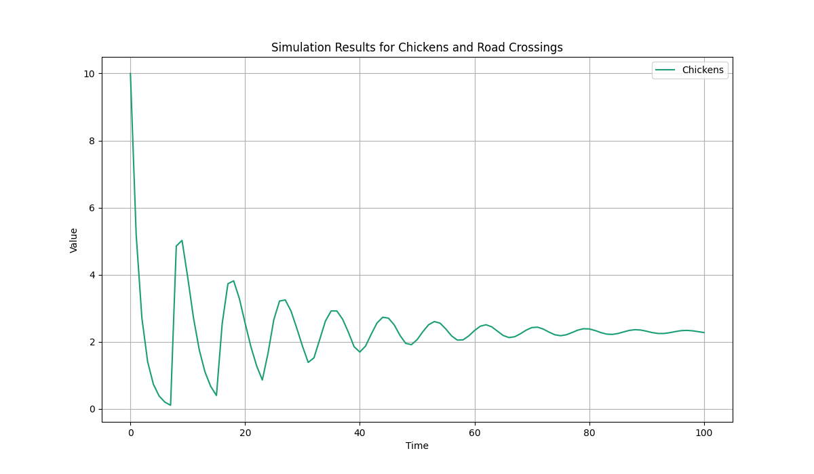

# MEAD: Modeling Environment for Analysis of Dynamics

`mead` is a simple Python framework for system dynamics modeling, allowing you
to build and simulate models using stocks, flows, and other components.

The name 'mead' is not only a type of beverage but also an homage to [Donella
Meadows](https://donellameadows.org/), a pioneering system dynamics thinker and
educator.

## Usage

Here is a example:

```python
from mead import Model, Stock, Flow, Delay, Auxiliary

with Model("Chickens and Road Crossings", dt=1) as model:
    # we start with 10 chickens
    chickens = Stock("Chickens", initial_value=10)

    # 60% of the chickens lay eggs
    egg_lays = Flow("Egg Lays", chickens * 0.6)
    # it takes 7 days for an egg to hatch
    brooding = Delay("Brooding", egg_lays, 7)
    # 80% of the eggs actually hatch
    egg_hatch = Flow("Egg Hatch", brooding * 0.8)
    # 80% chickens attempt to cross the road
    cross_attempts = Auxiliary("Attempt to cross", chickens * 0.8)
    # 60% of the cross attempts are fatal
    road_cross = Flow("Fatal Crossing", cross_attempts * 0.6)
    # new chickens...(instantaneous grown)
    chickens.add_inflow(egg_hatch)
    # lost chickens to fatal crossing...
    chickens.add_outflow(road_cross)


# Let's run the simulation for 100 days...
results = model.run(duration=100)
# and plot the results
model.plot(results, columns = [
    'Chickens',
    ])
```

This will produce a pandas DataFrame with the simulation results and a plot of
the 'Chickens' stock over time. Like so:




The directory [`examples/`](examples/) contains other examples of this framework usage.
