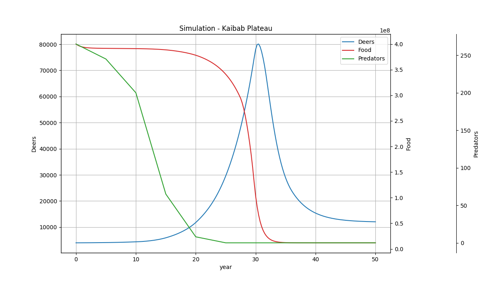
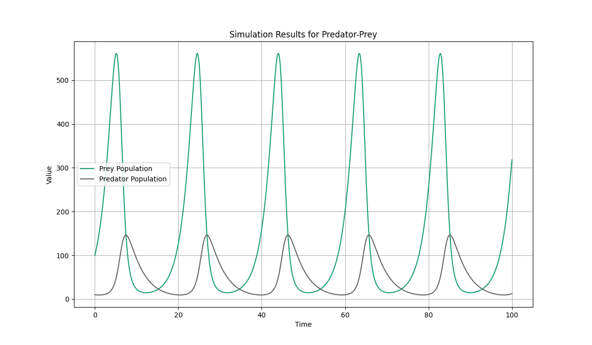
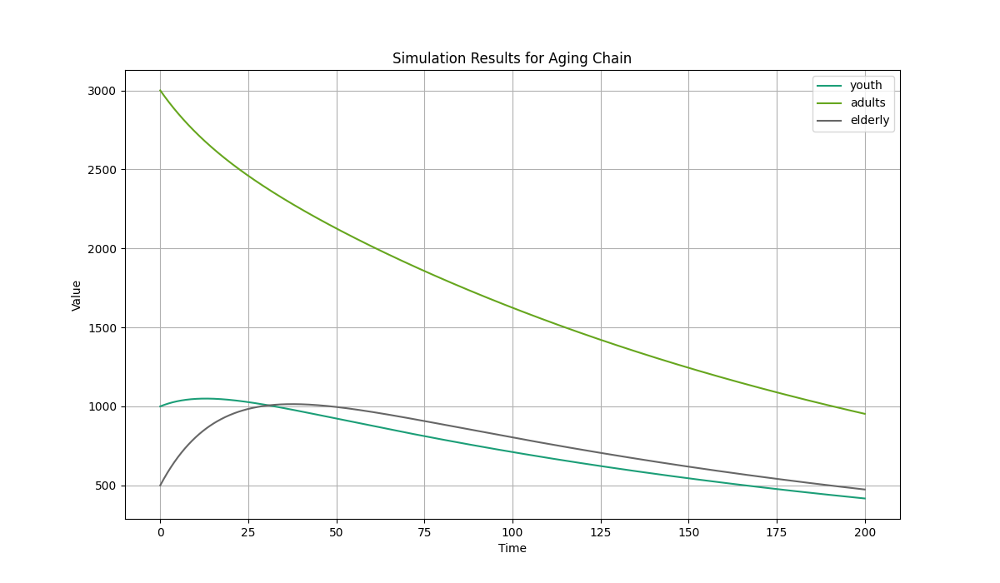
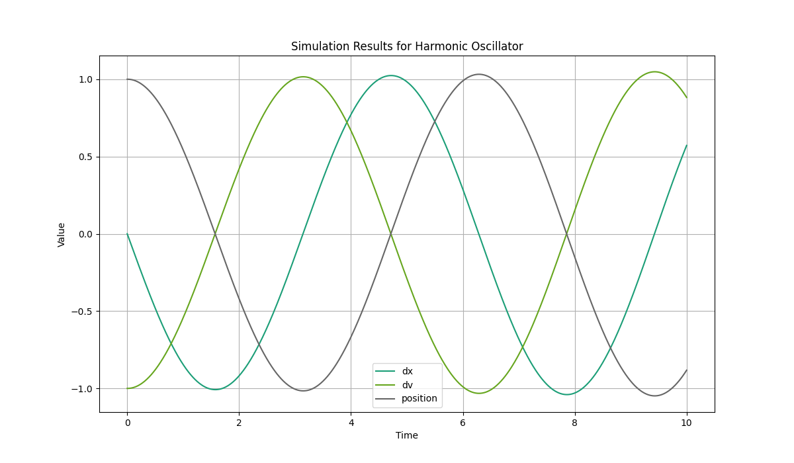
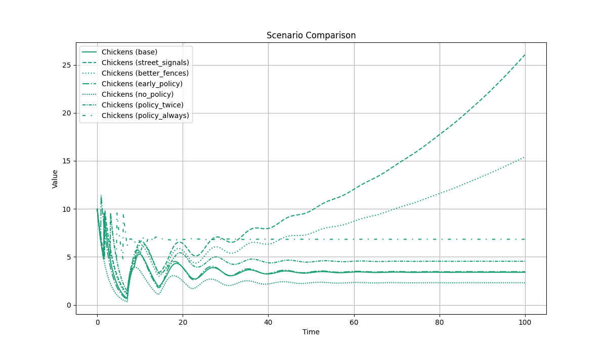

# List of examples using MEAD

## Kaibab Plateau

* [Donella Meadows - System Dynamics Model: Kaibab Deer Population](https://youtu.be/2rUXm5b-gZM?si=SIQX9VZDbFUchQLS)

## Lotka–Volterra (Predator Prey)

* [Lotka-Volterra](https://en.wikipedia.org/wiki/Lotka%E2%80%93Volterra_equations)

## Aging-Chain

## Harmonic Oscillator

## Chickens Crossing Scenarios

